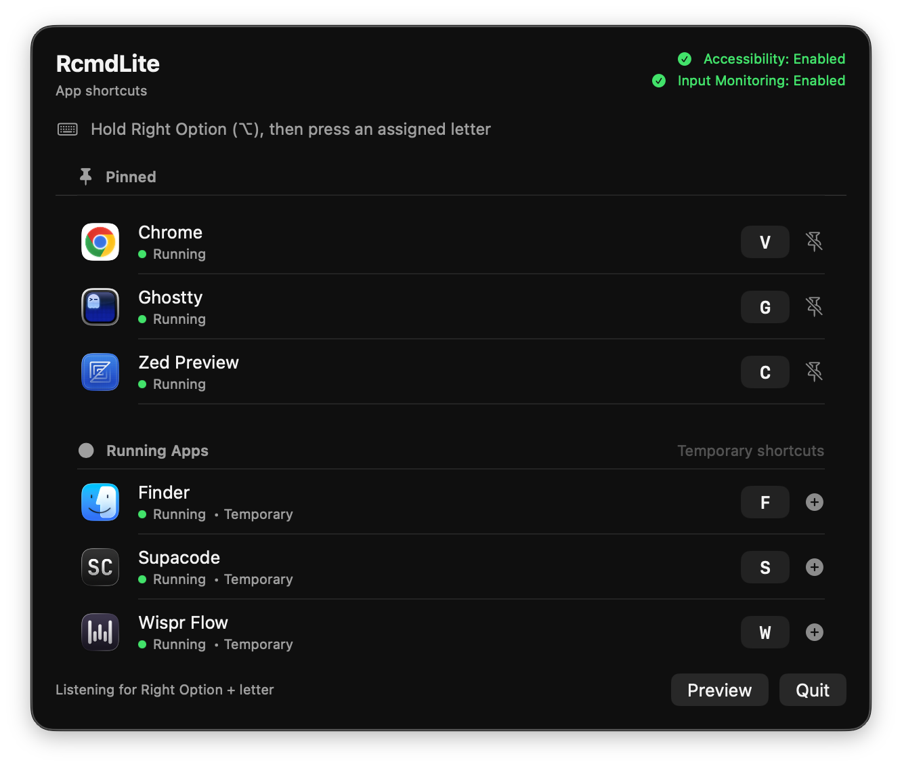
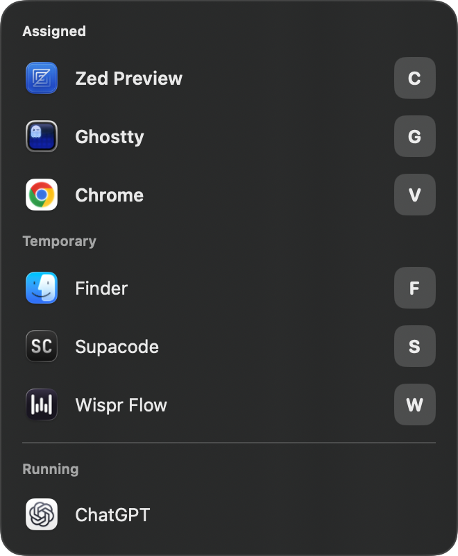

# RcmdLite

RcmdLite is a lightweight, macOS-only keyboard app switcher. Assign a letter to
an application, then press Right Option and that letter to launch it, focus it,
or cycle through all of its windows.

Static assignments always win their letter. Running applications without a
static assignment receive temporary shortcuts when their first letter is still
available; those shortcuts disappear when the application quits.

RcmdLite is a menu-bar accessory. It does not appear in the Dock or Command-Tab
switcher. Holding Right Option for 550 milliseconds displays a non-activating
shortcut preview in the lower-right corner.

## Screenshots

The settings window keeps permanent assignments pinned above temporary
shortcuts for currently running applications.

<p align="center">
  
</p>

After holding Right Option briefly, the shortcut preview appears without taking
focus from the current application.

<p align="center">
  
</p>

## Requirements

- macOS 13 or newer
- Swift 6.2 and the macOS SDK (install Xcode or the Xcode Command Line Tools)
- Accessibility and Input Monitoring permission for the packaged application

The project uses Swift Package Manager and does not require an Xcode project or
third-party dependencies.

## Build and test

Clone the repository and run the unit tests:

```sh
git clone https://github.com/jcampuza/rcmd-lite.git
cd rcmd-lite
swift test
```

For ordinary development, build a packaged debug application:

```sh
./scripts/build-debug.sh
open "$HOME/Applications/RcmdLite Debug.app"
```

The debug script uses Swift's unoptimized `debug` configuration and installs
`RcmdLite Debug.app` under `~/Applications`. You can also run `swift build` or
`swift run rcmd-lite`, but the resulting executable does not provide the stable
application bundle identity that macOS privacy permissions expect.

For an optimized local release build:

```sh
./scripts/build-release.sh
open "$HOME/Applications/RcmdLite.app"
```

The release script uses Swift's optimized `release` configuration, assembles a
standard application bundle, copies the icon and metadata, removes extended
attributes, and signs the result. Debug and release use separate bundle IDs and
application paths, so macOS grants their permissions independently.

| Build | Swift configuration | Application | Bundle identifier |
| --- | --- | --- | --- |
| Debug | `debug` | `~/Applications/RcmdLite Debug.app` | `com.josephcampuzano.rcmd-lite.debug` |
| Release | `release` | `~/Applications/RcmdLite.app` | `com.josephcampuzano.rcmd-lite` |

Set `RCMD_APP_PATH` to install either build somewhere else. Set
`RCMD_SIGNING_IDENTITY` to the exact name or SHA-1 hash of a specific identity
shown by `security find-identity -p codesigning -v`.

## Stable local signing

Rebuilding an ad-hoc-signed app can make macOS treat it as a new application,
requiring Accessibility and Input Monitoring permission again. Create one
persistent local identity before regular development:

```sh
./scripts/setup-dev-signing.sh
./scripts/signing-status.sh
```

After the setup script runs, trust `RcmdLite Development` for Code Signing in
Keychain Access, then keep that certificate and its private key. The build
scripts discover it automatically.

See [Stable development signing](docs/development-signing.md) for the complete
setup, verification, backup, troubleshooting, and release-distribution notes.
Never commit exported certificates, private keys, provisioning profiles, or
Apple credentials.

## Grant permissions

Launch the packaged app and use its permission buttons, or open System Settings
and grant that exact app bundle access under:

- Privacy & Security > Accessibility
- Privacy & Security > Input Monitoring

Restart the app after changing Input Monitoring permission. Debug and release
builds each need their own grants.

## Agent-friendly testing

Inspect running applications and computed temporary assignments without
changing focus:

```sh
swift run rcmd-devtool snapshot
```

The development tool also accepts one JSON request per line and exercises the
same command dispatcher with a recording controller, without launching or
focusing real applications:

```sh
echo '{"assignment":{"app":{"bundleIdentifier":"com.google.Chrome","name":"Chrome"},"key":"c","kind":"dynamic"},"running":true,"frontmost":false}' \
  | swift run rcmd-devtool
```

See [Architecture](docs/architecture.md) for target boundaries and the planned
packaged end-to-end test transport.

## Privacy

RcmdLite runs locally, does not include analytics or telemetry, and does not
send application or shortcut data over the network. Assignments are stored in
the current user's preferences.
